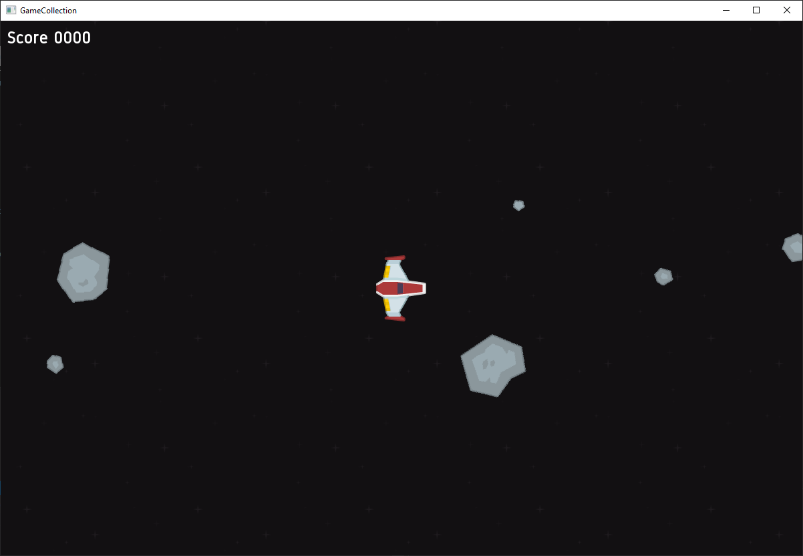

# Game Collection

A bunch of games collected in a single application for learning C++ and game design patterns. Uses SFML as graphics backend.




## How to build

Tested with MSVC and Clang, uses C++20

```
git clone https://github.com/hendrik-git/GameCollection

cd GameCollection
mkdir build
cd build

cmake -S .. -B .
cmake --build . --config Release --target GameCollectionApp
```