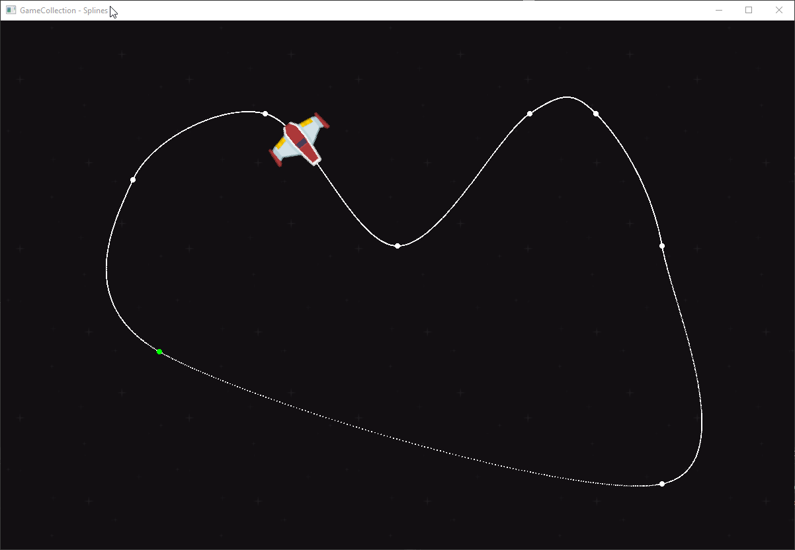

# Game Collection


A bunch of games and tech demos collected in a single application for learning C++ and game design patterns. Uses SFML as graphics backend.

## Games

### Asteroids

A simple Asteroids implementation using an entity-component-system. The game includes game state tracking (and displaying in a HUD), sound effects and particle effects.


### Splines

Implements a path consisting of Catmull–Rom splines. This path is used to move the ship along a trajectory defined by points. The rotation of the ship is derived from the gradient of the spline.



## How to build

Tested with MSVC and Clang, uses C++20

```
git clone https://github.com/hendrik-git/GameCollection
cd GameCollection
cmake -S . -B build
cmake --build build --config Release --target GameCollectionApp
```

### Linux

The GameCollection can also be used with Linux. Though SFML requires the following dependencies:
```
libsfml-dev
libudev-dev
libopenal-dev
libvorbis-dev
libflac-dev
libxcursor-dev
libfreetype6-dev 
libx11-dev 
libxrandr-dev
```